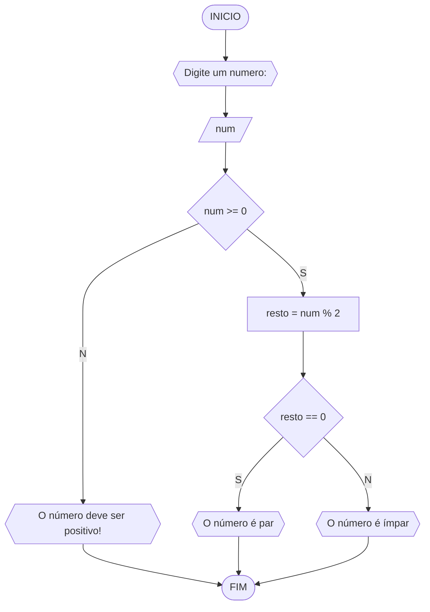

# UNIFOR 
**Nome**: Dionisio <br>
**Disciplina**: Raciocínio Lógico Algorítmico

## Lista de Exercícios 01

### Exercício 3
Represente, em fluxograma e pseudocódigo, um algoritmo pra determinar se um número inteiro e positivo é par ou ímpar.

#### Fluxograma

#### Pseudocódigo
```
ALGORITMO verfica_par_impar
DECLARE num: int, resto
INICIO
ESCREVA "Digite um número: "
LEIA num
SE num >= 0 ENTAO
    resto <- num % 2
    SE resto == 0 ENTAO
        ESCREVA "O número é par!"
    SENAO
        ESCREVA "O número é ímpar!"
    FIM_SE
SENAO
    ESCREVA "O número deve ser positivo!"
FIM_SE
FIM
 
```	
#### TESTE
| num | resto | num >= 0 | resto == 0 | Saída |
| --| --| --| --| -- |
| -1 | False |  |  | "O número deve ser positivo"
| 0 | True | 0 | True | "O número é par!"|
| 10 | True | 0 | True | "O número é par!"|
| 11 | True | 1 | False | "O número é ímpar!"|
